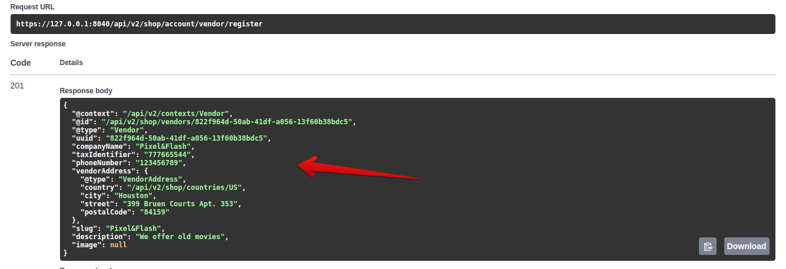

## OpenMarketplace Api

OpenMarketplace is based on Sylius, and use Sylius's package
[SyliusApiBundle](https://github.com/Sylius/SyliusApiBundle). 
It supports REST Api in JSON.

### SyliusApi

For resources provided by Sylius, API is created by SyliusApiBundle
and the documentation is available [here](https://master.demo.sylius.com/api/v2/docs)
and at `/api/v2/docs` URL.

### Authorization
In order to authorization you need a JWT token. Use endpoint
(`/api/v2/shop/authentication-token`) with your credentials. 

In the response, you will get a JWT token, and then you can set the authentication
token.

### Register as a vendor
Once you are an authorized user(1). Go to `/api/v2/shop/account/vendor/register`
endpoint and press button `Try it out`(2).

Fill in your data(1), and then execute(2).

### Vendor Api (for Vendors only)
Vendor has only access to itself resources.

- Managing details of Vendor.

- Managing product listing resources, which converts to products after administration acceptance.

- Creating and managing attributes for Vendor's products.

- Inventory(`/api/v2/shop/account/vendor/product-variants/{code}/inventory`) - each product variants can
be `tracked`, meaning you can not sell mor then the available amount. These endpoints allow you to manage
inventory of product variant. 
- Order(`/api/v2/shop/account/vendor/orders/...`) - you can get all your orders or get more details for one
order only. You can also cancel the order.
